# Dependency graph

_Generated by `node scripts/dep-graph.mjs` — 2026-09-25._

86 source modules. `scripts/` and `agent/` are excluded from the diagram (standalone tooling) but included in the index below.

```mermaid
graph LR
  subgraph "Pages"
    app_apply_page_tsx["app/apply/page.tsx"]
    app_error_tsx["app/error.tsx"]
    app_evolve_page_tsx["app/evolve/page.tsx"]
    app_github_page_tsx["app/github/page.tsx"]
    app_inbox_page_tsx["app/inbox/page.tsx"]
    app_interview_page_tsx["app/interview/page.tsx"]
    app_jobs_page_tsx["app/jobs/page.tsx"]
    app_layout_tsx["app/layout.tsx"]
    app_login_page_tsx["app/login/page.tsx"]
    app_outreach_page_tsx["app/outreach/page.tsx"]
    app_page_tsx["app/page.tsx"]
    app_practice_page_tsx["app/practice/page.tsx"]
    app_referrals_page_tsx["app/referrals/page.tsx"]
    app_resume_page_tsx["app/resume/page.tsx"]
    app_tailor_page_tsx["app/tailor/page.tsx"]
    app_validate_page_tsx["app/validate/page.tsx"]
  end
  subgraph "API routes"
    app_api_ai_route_ts["app/api/ai/route.ts"]
    app_api_auth_forgot_route_ts["app/api/auth/forgot/route.ts"]
    app_api_auth_login_route_ts["app/api/auth/login/route.ts"]
    app_api_auth_logout_route_ts["app/api/auth/logout/route.ts"]
    app_api_auth_verify_route_ts["app/api/auth/verify/route.ts"]
    app_api_email_send_route_ts["app/api/email/send/route.ts"]
    app_api_github_route_ts["app/api/github/route.ts"]
    app_api_inbox_sync_route_ts["app/api/inbox/sync/route.ts"]
    app_api_jobs_route_ts["app/api/jobs/route.ts"]
    app_api_parse_resume_route_ts["app/api/parse-resume/route.ts"]
    app_api_state_route_ts["app/api/state/route.ts"]
  end
  subgraph "Components"
    components_CopyButton_tsx["components/CopyButton.tsx"]
    components_Pager_tsx["components/Pager.tsx"]
    components_RunProgress_tsx["components/RunProgress.tsx"]
    components_Shell_tsx["components/Shell.tsx"]
    components_SyncProvider_tsx["components/SyncProvider.tsx"]
    components_UsageBanner_tsx["components/UsageBanner.tsx"]
    components_apply_ApplyKits_tsx["components/apply/ApplyKits.tsx"]
    components_apply_AutoPilot_tsx["components/apply/AutoPilot.tsx"]
  end
  subgraph "Lib"
    lib_aiCache_ts["lib/aiCache.ts"]
    lib_aiClient_ts["lib/aiClient.ts"]
    lib_ats_ts["lib/ats.ts"]
    lib_auth_ts["lib/auth.ts"]
    lib_claimCheck_ts["lib/claimCheck.ts"]
    lib_claudePrompt_ts["lib/claudePrompt.ts"]
    lib_clipboard_ts["lib/clipboard.ts"]
    lib_companyBoards_ts["lib/companyBoards.ts"]
    lib_gemini_ts["lib/gemini.ts"]
    lib_inboxFilters_ts["lib/inboxFilters.ts"]
    lib_jobFilters_ts["lib/jobFilters.ts"]
    lib_jobScore_ts["lib/jobScore.ts"]
    lib_kv_ts["lib/kv.ts"]
    lib_mail_ts["lib/mail.ts"]
    lib_openTabs_ts["lib/openTabs.ts"]
    lib_otp_ts["lib/otp.ts"]
    lib_outcomes_ts["lib/outcomes.ts"]
    lib_pdf_resumeDoc_tsx["lib/pdf/resumeDoc.tsx"]
    lib_pool_ts["lib/pool.ts"]
    lib_prompts_ts["lib/prompts.ts"]
    lib_quota_ts["lib/quota.ts"]
    lib_rateLimit_ts["lib/rateLimit.ts"]
    lib_roleSuggestions_ts["lib/roleSuggestions.ts"]
    lib_safeUrl_ts["lib/safeUrl.ts"]
    lib_session_ts["lib/session.ts"]
    lib_stableJson_ts["lib/stableJson.ts"]
    lib_store_ts["lib/store.ts"]
    lib_syncMerge_ts["lib/syncMerge.ts"]
    lib_types_ts["lib/types.ts"]
    lib_useCancellable_ts["lib/useCancellable.ts"]
  end
  subgraph "Root"
    middleware_ts["middleware.ts"]
    next_config_mjs["next.config.mjs"]
    postcss_config_mjs["postcss.config.mjs"]
    tailwind_config_ts["tailwind.config.ts"]
    tests_agentFields_test_mjs["tests/agentFields.test.mjs"]
    tests_helpers_mjs["tests/helpers.mjs"]
    tests_jobFilters_test_mjs["tests/jobFilters.test.mjs"]
    tests_scoring_test_mjs["tests/scoring.test.mjs"]
    tests_syncMerge_test_mjs["tests/syncMerge.test.mjs"]
  end
  app_api_ai_route_ts --> lib_aiCache_ts
  app_api_ai_route_ts --> lib_gemini_ts
  app_api_ai_route_ts --> lib_prompts_ts
  app_api_ai_route_ts --> lib_session_ts
  app_api_auth_forgot_route_ts --> lib_auth_ts
  app_api_auth_forgot_route_ts --> lib_kv_ts
  app_api_auth_forgot_route_ts --> lib_mail_ts
  app_api_auth_forgot_route_ts --> lib_otp_ts
  app_api_auth_forgot_route_ts --> lib_rateLimit_ts
  app_api_auth_login_route_ts --> lib_auth_ts
  app_api_auth_login_route_ts --> lib_rateLimit_ts
  app_api_auth_login_route_ts --> lib_session_ts
  app_api_auth_logout_route_ts --> lib_auth_ts
  app_api_auth_logout_route_ts --> lib_session_ts
  app_api_auth_verify_route_ts --> lib_auth_ts
  app_api_auth_verify_route_ts --> lib_mail_ts
  app_api_auth_verify_route_ts --> lib_otp_ts
  app_api_auth_verify_route_ts --> lib_rateLimit_ts
  app_api_auth_verify_route_ts --> lib_session_ts
  app_api_email_send_route_ts --> lib_session_ts
  app_api_github_route_ts --> lib_session_ts
  app_api_inbox_sync_route_ts --> lib_session_ts
  app_api_jobs_route_ts --> lib_companyBoards_ts
  app_api_jobs_route_ts --> lib_jobFilters_ts
  app_api_jobs_route_ts --> lib_session_ts
  app_api_parse_resume_route_ts --> lib_session_ts
  app_api_state_route_ts --> lib_kv_ts
  app_api_state_route_ts --> lib_session_ts
  app_api_state_route_ts --> lib_syncMerge_ts
  app_apply_page_tsx --> components_apply_ApplyKits_tsx
  app_apply_page_tsx --> components_apply_AutoPilot_tsx
  app_evolve_page_tsx --> components_CopyButton_tsx
  app_evolve_page_tsx --> lib_aiClient_ts
  app_evolve_page_tsx --> lib_claudePrompt_ts
  app_evolve_page_tsx --> lib_outcomes_ts
  app_evolve_page_tsx --> lib_store_ts
  app_evolve_page_tsx --> lib_types_ts
  app_github_page_tsx --> components_CopyButton_tsx
  app_github_page_tsx --> lib_aiClient_ts
  app_github_page_tsx --> lib_store_ts
  app_inbox_page_tsx --> components_Pager_tsx
  app_inbox_page_tsx --> components_RunProgress_tsx
  app_inbox_page_tsx --> lib_aiClient_ts
  app_inbox_page_tsx --> lib_inboxFilters_ts
  app_inbox_page_tsx --> lib_outcomes_ts
  app_inbox_page_tsx --> lib_pool_ts
  app_inbox_page_tsx --> lib_store_ts
  app_inbox_page_tsx --> lib_types_ts
  app_inbox_page_tsx --> lib_useCancellable_ts
  app_interview_page_tsx --> lib_aiClient_ts
  app_interview_page_tsx --> lib_store_ts
  app_jobs_page_tsx --> components_Pager_tsx
  app_jobs_page_tsx --> components_RunProgress_tsx
  app_jobs_page_tsx --> lib_aiClient_ts
  app_jobs_page_tsx --> lib_ats_ts
  app_jobs_page_tsx --> lib_jobFilters_ts
  app_jobs_page_tsx --> lib_jobScore_ts
  app_jobs_page_tsx --> lib_pool_ts
  app_jobs_page_tsx --> lib_quota_ts
  app_jobs_page_tsx --> lib_roleSuggestions_ts
  app_jobs_page_tsx --> lib_safeUrl_ts
  app_jobs_page_tsx --> lib_store_ts
  app_jobs_page_tsx --> lib_types_ts
  app_jobs_page_tsx --> lib_useCancellable_ts
  app_layout_tsx --> app_globals_css
  app_layout_tsx --> components_Shell_tsx
  app_outreach_page_tsx --> components_CopyButton_tsx
  app_outreach_page_tsx --> components_Pager_tsx
  app_outreach_page_tsx --> lib_aiClient_ts
  app_outreach_page_tsx --> lib_pdf_resumeDoc_tsx
  app_outreach_page_tsx --> lib_store_ts
  app_outreach_page_tsx --> lib_types_ts
  app_page_tsx --> lib_outcomes_ts
  app_page_tsx --> lib_quota_ts
  app_page_tsx --> lib_store_ts
  app_page_tsx --> lib_types_ts
  app_practice_page_tsx --> lib_aiClient_ts
  app_practice_page_tsx --> lib_store_ts
  app_practice_page_tsx --> lib_types_ts
  app_referrals_page_tsx --> components_CopyButton_tsx
  app_referrals_page_tsx --> components_Pager_tsx
  app_referrals_page_tsx --> lib_aiClient_ts
  app_referrals_page_tsx --> lib_store_ts
  app_referrals_page_tsx --> lib_types_ts
  app_resume_page_tsx --> lib_aiClient_ts
  app_resume_page_tsx --> lib_claimCheck_ts
  app_resume_page_tsx --> lib_pdf_resumeDoc_tsx
  app_resume_page_tsx --> lib_store_ts
  app_resume_page_tsx --> lib_types_ts
  app_tailor_page_tsx --> components_CopyButton_tsx
  app_tailor_page_tsx --> lib_aiClient_ts
  app_tailor_page_tsx --> lib_claimCheck_ts
  app_tailor_page_tsx --> lib_pdf_resumeDoc_tsx
  app_tailor_page_tsx --> lib_store_ts
  app_tailor_page_tsx --> lib_types_ts
  app_validate_page_tsx --> lib_aiClient_ts
  app_validate_page_tsx --> lib_store_ts
  app_validate_page_tsx --> lib_types_ts
  components_CopyButton_tsx --> lib_clipboard_ts
  components_Shell_tsx --> components_SyncProvider_tsx
  components_Shell_tsx --> components_UsageBanner_tsx
  components_SyncProvider_tsx --> lib_store_ts
  components_UsageBanner_tsx --> lib_quota_ts
  components_apply_ApplyKits_tsx --> components_Pager_tsx
  components_apply_ApplyKits_tsx --> components_RunProgress_tsx
  components_apply_ApplyKits_tsx --> lib_aiClient_ts
  components_apply_ApplyKits_tsx --> lib_clipboard_ts
  components_apply_ApplyKits_tsx --> lib_jobFilters_ts
  components_apply_ApplyKits_tsx --> lib_openTabs_ts
  components_apply_ApplyKits_tsx --> lib_outcomes_ts
  components_apply_ApplyKits_tsx --> lib_pdf_resumeDoc_tsx
  components_apply_ApplyKits_tsx --> lib_pool_ts
  components_apply_ApplyKits_tsx --> lib_safeUrl_ts
  components_apply_ApplyKits_tsx --> lib_store_ts
  components_apply_ApplyKits_tsx --> lib_types_ts
  components_apply_ApplyKits_tsx --> lib_useCancellable_ts
  components_apply_AutoPilot_tsx --> components_Pager_tsx
  components_apply_AutoPilot_tsx --> components_RunProgress_tsx
  components_apply_AutoPilot_tsx --> lib_aiClient_ts
  components_apply_AutoPilot_tsx --> lib_ats_ts
  components_apply_AutoPilot_tsx --> lib_jobFilters_ts
  components_apply_AutoPilot_tsx --> lib_openTabs_ts
  components_apply_AutoPilot_tsx --> lib_outcomes_ts
  components_apply_AutoPilot_tsx --> lib_pdf_resumeDoc_tsx
  components_apply_AutoPilot_tsx --> lib_pool_ts
  components_apply_AutoPilot_tsx --> lib_safeUrl_ts
  components_apply_AutoPilot_tsx --> lib_store_ts
  components_apply_AutoPilot_tsx --> lib_types_ts
  components_apply_AutoPilot_tsx --> lib_useCancellable_ts
  lib_aiCache_ts --> lib_kv_ts
  lib_aiCache_ts --> lib_stableJson_ts
  lib_aiClient_ts --> lib_quota_ts
  lib_aiClient_ts --> lib_stableJson_ts
  lib_aiClient_ts --> lib_store_ts
  lib_claudePrompt_ts --> lib_outcomes_ts
  lib_claudePrompt_ts --> lib_types_ts
  lib_companyBoards_ts --> lib_jobFilters_ts
  lib_gemini_ts --> lib_kv_ts
  lib_inboxFilters_ts --> lib_types_ts
  lib_jobScore_ts --> lib_types_ts
  lib_openTabs_ts --> lib_safeUrl_ts
  lib_otp_ts --> lib_auth_ts
  lib_otp_ts --> lib_kv_ts
  lib_outcomes_ts --> lib_jobFilters_ts
  lib_outcomes_ts --> lib_store_ts
  lib_outcomes_ts --> lib_types_ts
  lib_prompts_ts --> lib_types_ts
  lib_rateLimit_ts --> lib_kv_ts
  lib_roleSuggestions_ts --> lib_types_ts
  lib_session_ts --> lib_auth_ts
  lib_session_ts --> lib_kv_ts
  lib_store_ts --> lib_jobFilters_ts
  lib_store_ts --> lib_syncMerge_ts
  lib_store_ts --> lib_types_ts
  lib_syncMerge_ts --> lib_stableJson_ts
  middleware_ts --> lib_auth_ts
  tests_jobFilters_test_mjs --> tests_helpers_mjs
  tests_scoring_test_mjs --> tests_helpers_mjs
  tests_syncMerge_test_mjs --> tests_helpers_mjs
```

## Blast radius — most-imported modules

Change one of these and every file listed has to keep working.

| Module | Importers | Imported by |
| --- | --- | --- |
| `lib/types.ts` | 19 | `app/evolve/page.tsx`, `app/inbox/page.tsx`, `app/jobs/page.tsx`, `app/outreach/page.tsx`, `app/page.tsx`, `app/practice/page.tsx`, `app/referrals/page.tsx`, `app/resume/page.tsx`, `app/tailor/page.tsx`, `app/validate/page.tsx`, `components/apply/ApplyKits.tsx`, `components/apply/AutoPilot.tsx`, `lib/claudePrompt.ts`, `lib/inboxFilters.ts`, `lib/jobScore.ts`, `lib/outcomes.ts`, `lib/prompts.ts`, `lib/roleSuggestions.ts`, `lib/store.ts` |
| `lib/store.ts` | 17 | `app/evolve/page.tsx`, `app/github/page.tsx`, `app/inbox/page.tsx`, `app/interview/page.tsx`, `app/jobs/page.tsx`, `app/outreach/page.tsx`, `app/page.tsx`, `app/practice/page.tsx`, `app/referrals/page.tsx`, `app/resume/page.tsx`, `app/tailor/page.tsx`, `app/validate/page.tsx`, `components/SyncProvider.tsx`, `components/apply/ApplyKits.tsx`, `components/apply/AutoPilot.tsx`, `lib/aiClient.ts`, `lib/outcomes.ts` |
| `lib/aiClient.ts` | 13 | `app/evolve/page.tsx`, `app/github/page.tsx`, `app/inbox/page.tsx`, `app/interview/page.tsx`, `app/jobs/page.tsx`, `app/outreach/page.tsx`, `app/practice/page.tsx`, `app/referrals/page.tsx`, `app/resume/page.tsx`, `app/tailor/page.tsx`, `app/validate/page.tsx`, `components/apply/ApplyKits.tsx`, `components/apply/AutoPilot.tsx` |
| `lib/session.ts` | 10 | `app/api/ai/route.ts`, `app/api/auth/login/route.ts`, `app/api/auth/logout/route.ts`, `app/api/auth/verify/route.ts`, `app/api/email/send/route.ts`, `app/api/github/route.ts`, `app/api/inbox/sync/route.ts`, `app/api/jobs/route.ts`, `app/api/parse-resume/route.ts`, `app/api/state/route.ts` |
| `lib/auth.ts` | 7 | `app/api/auth/forgot/route.ts`, `app/api/auth/login/route.ts`, `app/api/auth/logout/route.ts`, `app/api/auth/verify/route.ts`, `lib/otp.ts`, `lib/session.ts`, `middleware.ts` |
| `lib/jobFilters.ts` | 7 | `app/api/jobs/route.ts`, `app/jobs/page.tsx`, `components/apply/ApplyKits.tsx`, `components/apply/AutoPilot.tsx`, `lib/companyBoards.ts`, `lib/outcomes.ts`, `lib/store.ts` |
| `lib/kv.ts` | 7 | `app/api/auth/forgot/route.ts`, `app/api/state/route.ts`, `lib/aiCache.ts`, `lib/gemini.ts`, `lib/otp.ts`, `lib/rateLimit.ts`, `lib/session.ts` |
| `components/Pager.tsx` | 6 | `app/inbox/page.tsx`, `app/jobs/page.tsx`, `app/outreach/page.tsx`, `app/referrals/page.tsx`, `components/apply/ApplyKits.tsx`, `components/apply/AutoPilot.tsx` |
| `lib/outcomes.ts` | 6 | `app/evolve/page.tsx`, `app/inbox/page.tsx`, `app/page.tsx`, `components/apply/ApplyKits.tsx`, `components/apply/AutoPilot.tsx`, `lib/claudePrompt.ts` |
| `components/CopyButton.tsx` | 5 | `app/evolve/page.tsx`, `app/github/page.tsx`, `app/outreach/page.tsx`, `app/referrals/page.tsx`, `app/tailor/page.tsx` |
| `lib/pdf/resumeDoc.tsx` | 5 | `app/outreach/page.tsx`, `app/resume/page.tsx`, `app/tailor/page.tsx`, `components/apply/ApplyKits.tsx`, `components/apply/AutoPilot.tsx` |
| `components/RunProgress.tsx` | 4 | `app/inbox/page.tsx`, `app/jobs/page.tsx`, `components/apply/ApplyKits.tsx`, `components/apply/AutoPilot.tsx` |
| `lib/pool.ts` | 4 | `app/inbox/page.tsx`, `app/jobs/page.tsx`, `components/apply/ApplyKits.tsx`, `components/apply/AutoPilot.tsx` |
| `lib/quota.ts` | 4 | `app/jobs/page.tsx`, `app/page.tsx`, `components/UsageBanner.tsx`, `lib/aiClient.ts` |
| `lib/safeUrl.ts` | 4 | `app/jobs/page.tsx`, `components/apply/ApplyKits.tsx`, `components/apply/AutoPilot.tsx`, `lib/openTabs.ts` |
| `lib/useCancellable.ts` | 4 | `app/inbox/page.tsx`, `app/jobs/page.tsx`, `components/apply/ApplyKits.tsx`, `components/apply/AutoPilot.tsx` |
| `lib/rateLimit.ts` | 3 | `app/api/auth/forgot/route.ts`, `app/api/auth/login/route.ts`, `app/api/auth/verify/route.ts` |
| `lib/stableJson.ts` | 3 | `lib/aiCache.ts`, `lib/aiClient.ts`, `lib/syncMerge.ts` |
| `tests/helpers.mjs` | 3 | `tests/jobFilters.test.mjs`, `tests/scoring.test.mjs`, `tests/syncMerge.test.mjs` |

## Reverse index — who imports what

Every module with at least one importer

- `lib/types.ts` ← `app/evolve/page.tsx`, `app/inbox/page.tsx`, `app/jobs/page.tsx`, `app/outreach/page.tsx`, `app/page.tsx`, `app/practice/page.tsx`, `app/referrals/page.tsx`, `app/resume/page.tsx`, `app/tailor/page.tsx`, `app/validate/page.tsx`, `components/apply/ApplyKits.tsx`, `components/apply/AutoPilot.tsx`, `lib/claudePrompt.ts`, `lib/inboxFilters.ts`, `lib/jobScore.ts`, `lib/outcomes.ts`, `lib/prompts.ts`, `lib/roleSuggestions.ts`, `lib/store.ts`
- `lib/store.ts` ← `app/evolve/page.tsx`, `app/github/page.tsx`, `app/inbox/page.tsx`, `app/interview/page.tsx`, `app/jobs/page.tsx`, `app/outreach/page.tsx`, `app/page.tsx`, `app/practice/page.tsx`, `app/referrals/page.tsx`, `app/resume/page.tsx`, `app/tailor/page.tsx`, `app/validate/page.tsx`, `components/SyncProvider.tsx`, `components/apply/ApplyKits.tsx`, `components/apply/AutoPilot.tsx`, `lib/aiClient.ts`, `lib/outcomes.ts`
- `lib/aiClient.ts` ← `app/evolve/page.tsx`, `app/github/page.tsx`, `app/inbox/page.tsx`, `app/interview/page.tsx`, `app/jobs/page.tsx`, `app/outreach/page.tsx`, `app/practice/page.tsx`, `app/referrals/page.tsx`, `app/resume/page.tsx`, `app/tailor/page.tsx`, `app/validate/page.tsx`, `components/apply/ApplyKits.tsx`, `components/apply/AutoPilot.tsx`
- `lib/session.ts` ← `app/api/ai/route.ts`, `app/api/auth/login/route.ts`, `app/api/auth/logout/route.ts`, `app/api/auth/verify/route.ts`, `app/api/email/send/route.ts`, `app/api/github/route.ts`, `app/api/inbox/sync/route.ts`, `app/api/jobs/route.ts`, `app/api/parse-resume/route.ts`, `app/api/state/route.ts`
- `lib/auth.ts` ← `app/api/auth/forgot/route.ts`, `app/api/auth/login/route.ts`, `app/api/auth/logout/route.ts`, `app/api/auth/verify/route.ts`, `lib/otp.ts`, `lib/session.ts`, `middleware.ts`
- `lib/jobFilters.ts` ← `app/api/jobs/route.ts`, `app/jobs/page.tsx`, `components/apply/ApplyKits.tsx`, `components/apply/AutoPilot.tsx`, `lib/companyBoards.ts`, `lib/outcomes.ts`, `lib/store.ts`
- `lib/kv.ts` ← `app/api/auth/forgot/route.ts`, `app/api/state/route.ts`, `lib/aiCache.ts`, `lib/gemini.ts`, `lib/otp.ts`, `lib/rateLimit.ts`, `lib/session.ts`
- `components/Pager.tsx` ← `app/inbox/page.tsx`, `app/jobs/page.tsx`, `app/outreach/page.tsx`, `app/referrals/page.tsx`, `components/apply/ApplyKits.tsx`, `components/apply/AutoPilot.tsx`
- `lib/outcomes.ts` ← `app/evolve/page.tsx`, `app/inbox/page.tsx`, `app/page.tsx`, `components/apply/ApplyKits.tsx`, `components/apply/AutoPilot.tsx`, `lib/claudePrompt.ts`
- `components/CopyButton.tsx` ← `app/evolve/page.tsx`, `app/github/page.tsx`, `app/outreach/page.tsx`, `app/referrals/page.tsx`, `app/tailor/page.tsx`
- `lib/pdf/resumeDoc.tsx` ← `app/outreach/page.tsx`, `app/resume/page.tsx`, `app/tailor/page.tsx`, `components/apply/ApplyKits.tsx`, `components/apply/AutoPilot.tsx`
- `components/RunProgress.tsx` ← `app/inbox/page.tsx`, `app/jobs/page.tsx`, `components/apply/ApplyKits.tsx`, `components/apply/AutoPilot.tsx`
- `lib/pool.ts` ← `app/inbox/page.tsx`, `app/jobs/page.tsx`, `components/apply/ApplyKits.tsx`, `components/apply/AutoPilot.tsx`
- `lib/quota.ts` ← `app/jobs/page.tsx`, `app/page.tsx`, `components/UsageBanner.tsx`, `lib/aiClient.ts`
- `lib/safeUrl.ts` ← `app/jobs/page.tsx`, `components/apply/ApplyKits.tsx`, `components/apply/AutoPilot.tsx`, `lib/openTabs.ts`
- `lib/useCancellable.ts` ← `app/inbox/page.tsx`, `app/jobs/page.tsx`, `components/apply/ApplyKits.tsx`, `components/apply/AutoPilot.tsx`
- `lib/rateLimit.ts` ← `app/api/auth/forgot/route.ts`, `app/api/auth/login/route.ts`, `app/api/auth/verify/route.ts`
- `lib/stableJson.ts` ← `lib/aiCache.ts`, `lib/aiClient.ts`, `lib/syncMerge.ts`
- `tests/helpers.mjs` ← `tests/jobFilters.test.mjs`, `tests/scoring.test.mjs`, `tests/syncMerge.test.mjs`
- `lib/ats.ts` ← `app/jobs/page.tsx`, `components/apply/AutoPilot.tsx`
- `lib/claimCheck.ts` ← `app/resume/page.tsx`, `app/tailor/page.tsx`
- `lib/clipboard.ts` ← `components/CopyButton.tsx`, `components/apply/ApplyKits.tsx`
- `lib/mail.ts` ← `app/api/auth/forgot/route.ts`, `app/api/auth/verify/route.ts`
- `lib/openTabs.ts` ← `components/apply/ApplyKits.tsx`, `components/apply/AutoPilot.tsx`
- `lib/otp.ts` ← `app/api/auth/forgot/route.ts`, `app/api/auth/verify/route.ts`
- `lib/syncMerge.ts` ← `app/api/state/route.ts`, `lib/store.ts`
- `components/Shell.tsx` ← `app/layout.tsx`
- `components/SyncProvider.tsx` ← `components/Shell.tsx`
- `components/UsageBanner.tsx` ← `components/Shell.tsx`
- `components/apply/ApplyKits.tsx` ← `app/apply/page.tsx`
- `components/apply/AutoPilot.tsx` ← `app/apply/page.tsx`
- `lib/aiCache.ts` ← `app/api/ai/route.ts`
- `lib/claudePrompt.ts` ← `app/evolve/page.tsx`
- `lib/companyBoards.ts` ← `app/api/jobs/route.ts`
- `lib/gemini.ts` ← `app/api/ai/route.ts`
- `lib/inboxFilters.ts` ← `app/inbox/page.tsx`
- `lib/jobScore.ts` ← `app/jobs/page.tsx`
- `lib/prompts.ts` ← `app/api/ai/route.ts`
- `lib/roleSuggestions.ts` ← `app/jobs/page.tsx`

## Warnings

- No import cycles.
- Unreferenced (nothing imports them, and they are not entry points): `tests/agentFields.test.mjs`, `tests/jobFilters.test.mjs`, `tests/scoring.test.mjs`, `tests/syncMerge.test.mjs`

